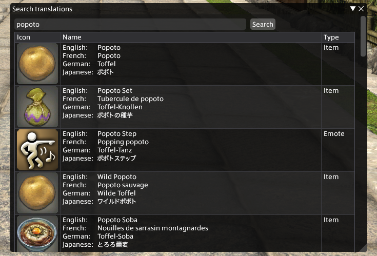
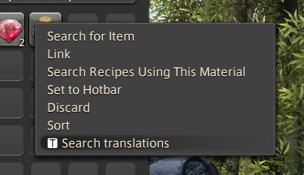

# Easy Translate

Easy Translate is a [Dalamud](https://github.com/goatcorp/Dalamud) plugin that allows you to search the translations for almost anything in Final Fantasy XIV!
It's really useful when you are playing with people who have the game in another language.

You can open a search window by entering `/et` in the chat window. You will now be able to search translations for many in-game elements!

You can also right-click an item in your inventory to open a search window with the item's name pre-populated!

## How To Install

EasyTranslate is available in the official dalamud repo. You can simply search for it in the Plugin Installer window.

## For developers

### Prerequisites

EasyTranslate assumes all the following prerequisites are met:

* XIVLauncher, FINAL FANTASY XIV, and Dalamud have all been installed and the game has been run with Dalamud at least once.
* XIVLauncher is installed to its default directories and configurations.
  * If a custom path is required for Dalamud's dev directory, it must be set with the `DALAMUD_HOME` environment variable.
* A .NET Core 7 SDK has been installed and configured, or is otherwise available. (In most cases, the IDE will take care of this.)

### Building

1. Open up `EasyTranslate.sln` in your C# editor of choice (likely [Visual Studio 2022](https://visualstudio.microsoft.com) or [JetBrains Rider](https://www.jetbrains.com/rider/)).
2. Build the solution. By default, this will build a `Debug` build, but you can switch to `Release` in your IDE.
3. The resulting plugin can be found at `EasyTranslate/bin/x64/Debug/SamplePlugin.dll` (or `Release` if appropriate.)

### Activating in-game

1. Launch the game and use `/xlsettings` in chat or `xlsettings` in the Dalamud Console to open up the Dalamud settings.
    * In here, go to `Experimental`, and add the full path to the `SamplePlugin.dll` to the list of Dev Plugin Locations.
2. Next, use `/xlplugins` (chat) or `xlplugins` (console) to open up the Plugin Installer.
    * In here, go to `Dev Tools > Installed Dev Plugins`, and the `SamplePlugin` should be visible. Enable it.
3. You should now be able to use `/et` (chat) or `et` (console)!

Note that you only need to add it to the Dev Plugin Locations once (Step 1); it is preserved afterwards. You can disable, enable, or load your plugin on startup through the Plugin Installer.
